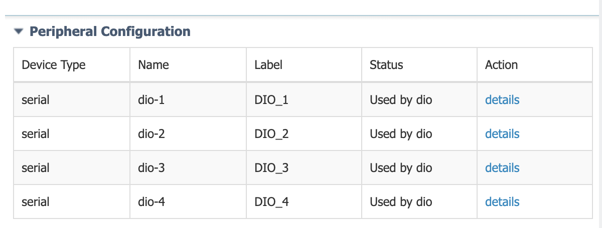

# Read digital IO (Alarm) status on Cisco IR1101 using Cisco IOx with Python

This application runs on Cisco IR1101 with Cisco IOx. It reads the status of the Digital Input/Output port (sometimes referred to as General Purpose Input/Output or GPIO) available on the router's IRM-1100-SPMI expansion module.

  
*Digital I/O port shown here*

The Digital I/O connector has 4 GPIO connections plus 1 Return connection. The Digital I/O supports Both Dry and Wet contacts up to 60Volts.

* Dry contact is isolated from a voltage source (or “No Volt”), with an embedded relay function (NPN transistor), usually used to indicate an event. For example: open/close, alarm.
* Wet contact is a contact with external power (+3.3V to +60V, max 150mA of current allowed at high voltage) applied, usually used to energize something. For example: solenoid, light.

To know more about Digital I/O ports refer to the [IR1101 hardware guide](https://www.cisco.com/c/en/us/td/docs/routers/access/1101/b_IR1101HIG/b_IR1101HIG_chapter_01.html#con_1232292).

Only Digital I/O ports on the IRM-1100-SPMI extension module are supported in Cisco IOx. The alarm port of the base IR1101 chassis is not supported in IOx at the time of writing (Cisco IOS-XE 17.2.1). The alarm port on the base chassis is input only and can be used is Cisco IOS-XE.

## Use Case Description

This IOx application is able to read the status of the 4 Digital I/O ports. In this particular case, the application will log the status of the 4 ports in a log file, accessible from Cisco IOx Local Manager.

In practice you may want to send that status to an external MQTT broker, an REST API or otherwise trigger local actions.

## Prerequisites

* Cisco IR1101 with the IRM-1100-SPMI expansion module. This module has the four Digital I/O ports that will be monitored.
* Cisco IOx Application Hosting must be enabled [as explained in the IR1101 IOx Application Hosting documentation](https://www.cisco.com/c/en/us/td/docs/routers/access/1101/software/configuration/guide/b_IR1101config/b_IR1101config_chapter_010001.html).
* Development machine with Git, Docker, [ioxclient](https://developer.cisco.com/docs/iox/#!iox-resource-downloads), and internet access.
* Expose Digital I/O ports to Cisco IOx (see below)

Cisco IR1101 Digital I/O ports are usable directly in Cisco IOS-XE for example using the Embedded Event Manager (EEM), however to be usable with Cisco IOx the ports will need to be exposed to IOx CAF framework using this configuration command in Cisco IOS-XE:

    ir1101# config terminal
    ir1101(config)# alarm contact attach-to-iox
    ir1101(config)# end

You can check the port status using the CLI command "show alarm" and make sure the ports are "Attached to IOx" as shown below:

    ir1101#sh alarm
    Alarm contact 0:
       Description: External alarm contact on mother board
       Status:      Asserted
       Application: Dry
       Severity:    Minor
       Trigger:     Closed
       Mode:        Input

    Digital I/O 1:
       Attached to IOX.

    Digital I/O 2:
       Attached to IOX.

    Digital I/O 3:
       Attached to IOX.

    Digital I/O 4:
       Attached to IOX.

## Building the application

Here are the steps to build the IOx application, alternatively you can also check the [precompiled releases with ready-to-run IOx application](https://github.com/etychon/iox-ir1101-dio-read/releases).

Start by cloning the repository:

    $ git clone https://github.com/etychon/iox-ir1101-dio-read.git

Enter the directory and launch the build:

    $ cd iox-ir1101-dio-read/
    $ ./build

If the build is successful you should have an IOx application with a file name `iox-ir1101-dio-<date>-<time>.tar` in your directory. For example `iox-ir1101-dio-20200306-073253.tar`.

The `build` command essentially does two things:

* It builds the Docker image with
      docker build -t iox-ir1101-dio .

* It builds an IOx image based on the Docker container with:
      ioxclient docker package iox-ir1101-dio . -n iox-ir1101-dio-\`date +"%Y%m%d-%H%M%S"\`

## Installation

Log in to Cisco IOx Local Manager and simply click on "Add New" application and select the TAR file you've just created.

  
*Adding a new application in IOx*

## Activation

Under IOx, the Digital I/O ports are exposed as char devices under the device names /dev/dio-1 up to /dev/dio-4. The ports will need to be assigned as serial ports to the running IOx application at activation time using Cisco IOx local manager.

In IOx Local Manager click the `Activate` button and assign all Digital I/O ports like so:


If your application do not need all the Digital I/O ports, this can be easily edited in the `package.yaml` file. If you'd like to know more about the options offered by `package.yaml` please check the DevNet documentation on [Package Descriptors](https://developer.cisco.com/docs/iox/#!package-descriptor).

In `package.yaml` the Digital I/O that are are not needed can be removed under the following section and then rebuild the application:

```
    resources:
      profile: c1.tiny
      devices:
        -
          label: DIO_1
          type: serial
          usage: "GPIO Port 1"
        -
          label: DIO_2
          type: serial
          usage: "GPIO Port 2"
        -
          label: DIO_3
          type: serial
          usage: "GPIO Port 3"
        -
          label: DIO_4
          type: serial
          usage: "GPIO Port 4"
```

If all four Digital I/O are configured, it should look like this in Cisco IOx Local Manager:


*DIO ports are to be assigned to the software DIO ports*

Click on the upper right `Activate App` button, then go back to the application list and select `Start`, like so:


The application is now running and the Python script `startup.py` will now parse all possible Digital I/O and deliver a status for each of them. Three states are possible:

* `0` : the contact on this port is closed
* `1` : the contact on this port is open
* `-` : The Python script cannot find this port because it has not been activated for the running application

In Cisco IOx Local Manager click on your application `Manage` option and navigate to the `Logs` tab. A file called `iox-dio.log` created by the Python script should be there listing the Digital I/O status like so:


*Applicaton Log as seen in Local Manager "logs"*

## Poking around

If you want to play with the DIO ports manually, you can launch this IOx application and then request an IOx console which will let you play with the following commands:

```
    # To change pin to input mode
    echo in > /dev/dio-1
 
    # To change pin to output mode
    echo out > /dev/dio-1
 
    # To read pin value
    cat /dev/dio-1
 
    # To update pin value
    echo 1 > /dev/dio-1
    echo 0 > /dev/dio-1
```

You can request a console to the container from IOS-XE with command such as this one where you'll replace <application_name> by your IOx application name:

    IR1101# app-hosting connect appid <application_name> session /bin/bash
