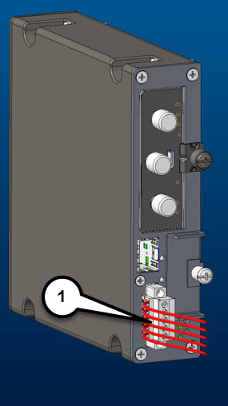

# Read digital IO (Alarm) status on Cisco IR1101 using Cisco IOx with Python

This application runs on Cisco IR1101 with Cisco IOx. It reads the status of the Digital Input/Output port (sometimes referred to as General Purpose Input/Output or GPIO) available on the router's IRM-1100-SPMI expansion module.

  
*Digital I/O port shown here*

The Digital I/O connector has 4 GPIO connections plus 1 Return connection. The Digital I/O supports Both Dry and Wet contacts up to 60Volts.

* Dry contact is isolated from a voltage source (or “No Volt”), with an embedded relay function (NPN transistor), usually used to indicate an event. For example: open/close, alarm.
* Wet contact is a contact with external power (+3.3V to +60V, max 150mA of current allowed at high voltage) applied, usually used to energize something. For example: solenoid, light.

To know more about Digital I/O ports refer to the [IR1101 hardware guide](https://www.cisco.com/c/en/us/td/docs/routers/access/1101/b_IR1101HIG/b_IR1101HIG_chapter_01.html#con_1232292).

Only Digital I/O ports on the IRM-1100-SPMI extension module are supported in Cisco IOx. The alarm port of the base IR1101 chassis is not supported in IOx at the time of writing (Cisco IOS-XE 17.2.1). The alarm port on the base chassis is input only and can be used is Cisco IOS-XE.

## Prerequisites

* Cisco IR1101 with the SPMI expansion module. This module has 4 general-purpose input/output (GPIO) ports.
* Development machine with Docker, ioxclient, and internet access.
* Expose GPIO ports to Cisco IOx

Cisco IR1101 GPIO ports are usable in Cisco IOS-XE for example using the Embedded Event Manager (EEM), however to be usable with Cisco IOx the ports will need to tbe exposed to IOx CAF framework using this configuration command in Cisco IOS-XE:

    SPARROW-UUT1# config terminal
    SPARROW-UUT1(config)# alarm contact attach-to-iox
    SPARROW-UUT1(config)# end

## How this works?

Under IOx, the GPIO ports are exposed as char devices under the device names /dev/dio-1 up to /dev/dio-4. The ports will need to be assigned to the running IOx application at activation time using an activation payload or Cisco IOx local manager like so:

*DIO ports are to be assigned to the software DIO ports*

In addition, for IOx local manager to list the ports, they also need to be present in the package.yaml. If you don't know or understand how to do this please check the DevNet documentation on [Package Descriptors](https://developer.cisco.com/docs/iox/#!package-descriptor).

In this example, the Python script `startup.py`will parse all possible DIO port numbers, and deliver a status for each of them. Three states are possible:

* 0 : the contact on this port is closed
* 1 : the contact on this port is open
* - : The Python script cannot find this port because it has not been activated / exposed to the running application

When the application runs, check the IOx application logs (in Local Manager) and you should see something like:

*Applicaton Log as seen in Local Manager "logs"*

## Poking around

If you want to play with the DIO ports manually, you can launch this IOx application and then request an IOx console which will let you play with the following commands:

    # To change pin to input mode
    echo in > /dev/dio-1
 
    # To change pin to output mode
    echo out > /dev/dio-1
 
    # To read pin value
    cat /dev/dio-1
 
    # To update pin value
    echo 1 > /dev/dio-1
    echo 0 > /dev/dio-1

You can request a console to the container from IOS-XE with command such as this one where you'll replace <application_name> by your IOx application name:

    IR1101# app-hosting connect appid <application_name> session /bin/bash

## Packaging

This application is build as a Docker container, and you can use the "./build" command to build the IOx application.

Alternatively you can also check our precompiled releases with ready-to-run IOx application.
